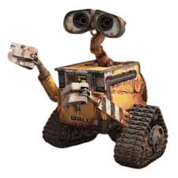
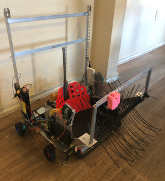
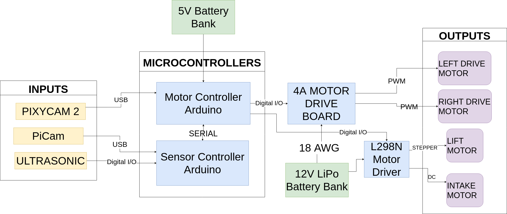
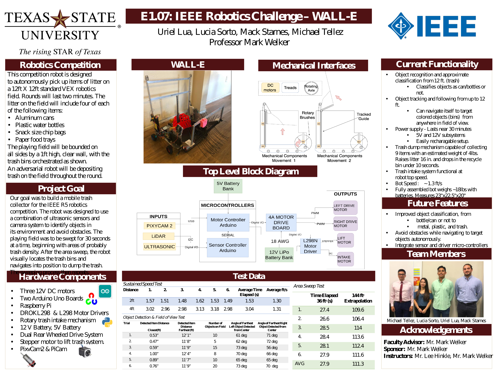

# WALL-E 

The purpose of this project is to design a robot to 2020 IEEE R5 robotics competition that can collect and sort trash and dispose of trash. One of the motivations of the competition rules is to drive the development and innovation of technologies that can autonomously collect commonly littered items and transport them to a proper receptacle. Using computer vision, image processing, and motor control algorithms, a system could be implemented to reduce litter in natural areas with a relatively low amount of human work hours. 

&nbsp;  

Competition Robot - 23"x22.5"x20" - 18lbs

&nbsp; 
&nbsp; 

# Hardware 
&nbsp; 
&nbsp; 
## Arduino (x2)
   * Requirements
      * Uno or Mega Boards
      * Arduino IDE for upload
   * Status
      * Fully integrated
      * Controls motor functions and trash intake/dumping  
      

## Raspberry Pi 4
   * Requirements
     * python 3.2+
     * opencv2 and lib-usb installed
        * `pip install opencv2` or `pip3 install opencv2`  
   * Status
     * Demos work internally on raspi.
     * Need to interface with motor controller/arduino  
      

## Cameras
   * PixyCam2
      * Requirements
        * pixymon for programming color-codes
      * Status
        * Fully integrated into system
        * Directs navigation to programmed objects
   * Pi Cam  
      * Requirements
        * Python 3.2+
        * Raspberry Pi 3 or better
      * Status
        * Object detection functional
           * Classifies objects and produces their coordinates
        * Needs to be intehrated into motor-driver functionality  
        
        
## Power Supply
   * 12V LiPo
   * 5V portable cell-phone battery pack  

## Motors
  * Drive 
    * (2x) 
    * 12V DC
    * 0.5A unloaded, 20.7A stall
    * 317 rpm
  * Lift
    * Stepper Motor
    * Holding Torque: 18Kg.cm
  * Intake
     * 0.1A unloaded
     * 6000 rpm unloaded 

## Sensors
  * LiDAR
    * Resolution:	1 mm
    * Maximum range:	400 cm2
    * Minimum range:	4 cm3
    * Interface:	I²C
    * Operating voltage:	2.6-5.5 V
    * Supply current:	0.015A

&nbsp;  
&nbsp;  
&nbsp;  
&nbsp;
&nbsp;  
&nbsp;

&nbsp;  
&nbsp;  
&nbsp;  
&nbsp;  
&nbsp;  
&nbsp;  
&nbsp;  

 

&nbsp;  
&nbsp;  
&nbsp;  
&nbsp;  
&nbsp;  
&nbsp;  

###### MIT License
###### Copyright (c) [2020] [Mack Starnes, Uriel Lua, Lucia Sorto, Michael Telleze]
&nbsp;  
###### Permission is hereby granted, free of charge, to any person obtaining a copy of 
###### this software and associated documentation files (the "Software"), to deal in 
###### the Software without restriction, including without limitation the rights to 
###### use, copy, modify, merge, publish, distribute, sublicense, and/or sell
###### copies of the Software, and to permit persons to whom the Software is
###### furnished to do so, subject to the following conditions:  
&nbsp;  
###### The above copyright notice and this permission notice shall be
###### included in all copies or substantial portions of the Software.  
###### THE SOFTWARE IS PROVIDED "AS IS", WITHOUT WARRANTY OF ANY KIND, 
###### EXPRESS OR IMPLIED, INCLUDING BUT NOT LIMITED TO THE WARRANTIES OF MERCHANTABILITY,
###### FITNESS FOR A PARTICULAR PURPOSE AND NONINFRINGEMENT. IN NO EVENT SHALL THE
###### AUTHORS OR COPYRIGHT HOLDERS BE LIABLE FOR ANY CLAIM, DAMAGES OR OTHER LIABILITY, 
###### WHETHER IN AN ACTION OF CONTRACT,TORT OR OTHERWISE, ARISING FROM, OUT OF OR
###### IN CONNECTION WITH THE SOFTWARE OR THE USE OR OTHER DEALINGS IN THE SOFTWARE.

